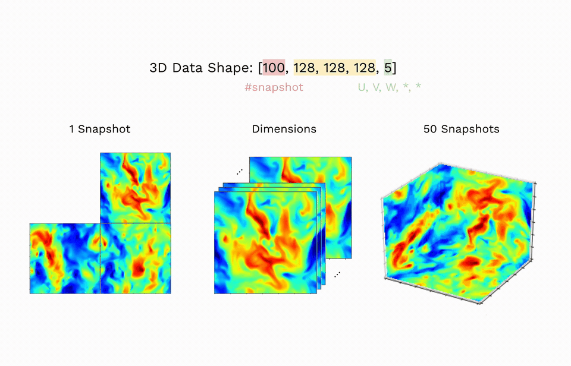

# Equivariant Neural Networks for Turbulent Flows

Deep learning models for turbulent-flow prediction that build the physical symmetries of fluid
dynamics directly into the network architecture. Using a custom anisotropic equivariant CNN, this
repository studies how progressively incorporating symmetry groups — **uniform motion** (Galilean
boost, `UM`), **rotation** (`Rot`), **magnitude scaling** (`Mag`), and **spatial scaling**
(`Scale`) — improves generalization on 2D/3D turbulence data. Each experiment combines one more
symmetry than the last and is evaluated both for *equivariance* (does the output transform
correctly under the symmetry?) and for *predictive accuracy* against the standard turbulence
diagnostics (energy spectra and structure functions).

  

  <a href="https://arxiv.org/abs/1911.08655">Towards Physics-informed Deep Learning for Turbulent Flow Prediction</a>

## Repository layout
- `UM/`, `Rot/` — single-symmetry baselines (uniform motion and rotation equivariance).
- `Rot-UM/`, `Rot-UM-Mag/`, `Rot-UM-Scale/` — models that combine multiple symmetry groups (see experiments below).
- `3D/` — 3D turbulence dataset loader and the diagnostics code (energy spectra / structure-function tests); see [`3D/diagnosticsCode/README.md`](3D/diagnosticsCode/README.md).
- `Data/` — dataset preparation and augmented test sets for each transformation.

## Experiments

Each experiment follows the same three-step protocol: (1) verify equivariance of the trained
model, (2) train on untransformed data and test on transformed data, and (3) train and test on the
transformed data.

### Rot-UM
1. test for equivariance: check UM and Rot eq
2. train on untransformed, test on UM, Rot, UM + Rot
3. train on random UM + Rot, test on UM + Rot (same dataset)
  - how to generate UM + Rot dataset: add UM (diff vec - selected from a circle) for u and v), then Rot 
  - rmse only on the 64 * 64 (check vs all)

### Rot-UM-Mag
1. test for equivariance: check UM, Rot and Mag eq
2. train on untransformed, test UM + Rot + Mag
3. train on UM + Rot + Mag, test on UM + Rot + Mag

### Rot-Um-Scale
1. test for equivariance: check UM, Rot and Scale eq
2. train on untransformed, test UM + Rot + Scale
3. train on UM + Rot + Scale, test on UM + Rot + Scale
  - transformation in order of: scale, Rot, UM
  - pad the results to 128 * 128

### ρ_n
The full symmetry group: combine all transformations (Rot + UM + Mag + Scale) into a single
equivariant model and measure how performance scales as more symmetries are stacked.
1. test for equivariance: check Rot, UM, Mag and Scale eq
2. train on untransformed, test on Rot + UM + Mag + Scale
3. train on random Rot + UM + Mag + Scale, test on Rot + UM + Mag + Scale
  - apply transformations in order of: scale, Mag, Rot, UM
  - report RMSE per added symmetry to quantify the marginal effect of each group